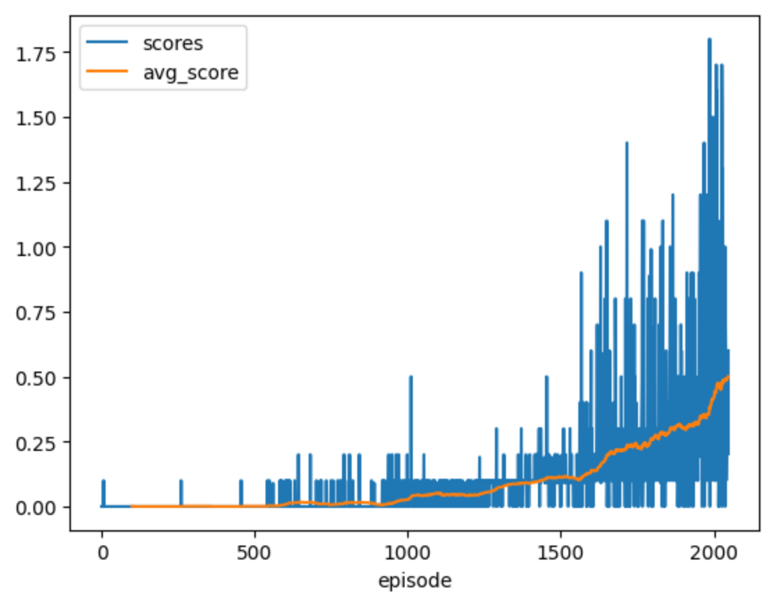

# Introduction
that provides a description of the implementation

# Learning Algorithm
The report clearly describes the learning algorithm, along with the chosen hyperparameters. It also describes the model architectures for any neural networks.

# Plot of Rewards

The problem solved in 2048 episodes. The following figure shows the overall scores.

# Ideas for Future Work
The submission has concrete future ideas for improving the agent's performance.
